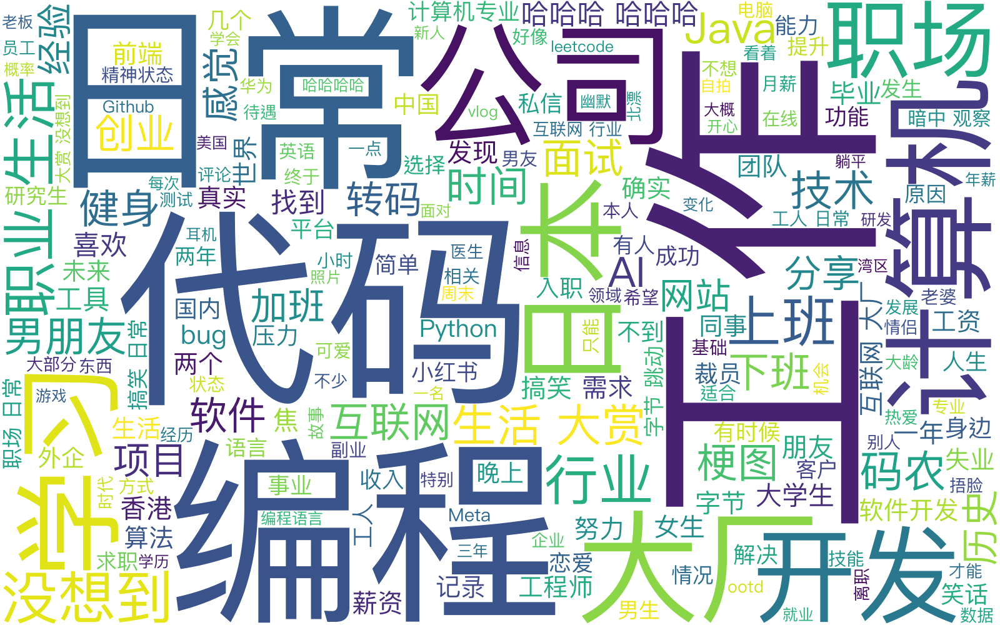

# fdu_24_ICS_pj

## Intro

2024秋季学期信息内容安全PJ

### 目录结构

```bash
.
|-README.md		# README.md
|-report/		# 报告及文档
|-code/			# 代码部分
|-source/		# 静态资源
```

### 主题

### 分工

## Release 使用方法

### Linux


```bash
python -m venv venv # 或者 python3 -m venv venv
source ./venv/bin/activate # in Linux
pip install -r requirements.txt # 或者 pip3 install -r requirements.txt
python FileName.py # 或者 python3 FileName.py
```

### Windows

```powershell
python -m venv venv
.\venv\bin\activate # in Windows
pip install -r requirements.txt
python FileName.py
```

### 退出程序与虚拟环境

```bash
<Ctrl+C> # 退出程序
deactivate # 退出虚拟环境
```

## 前情提要

假如你是一名计算机学院的学生，你的老师布置了一项任务，要求做一项关于爬虫和数据分析相关的 PJ。可是刚刚接触爬虫的你并不知道怎么开启这个任务，于是决定<del>摆烂</del>在网上学习一下相关内容！

- StackOverflow：世界上最为流行的技术问答社区，你遇到的一切计算机相关问题几乎都可以在上面找到答案
- 小红书：中国最大的生活分享平台，程序员作为一类沉默而庞大的人群当然也混迹其中
- 知乎：中国目前最大的知识问答社区，每天都有关于形形色色问题的大量讨论
- 公众号：依托中国最大的社交软件微信，许多计算机从业者源源不断地在上面产出文章

那么不妨让我们研究一下程序员在这些网络平台的冲浪情况吧！

### 研究问题

- 作为程序员每天要干的一件事当然是编程啦！那么程序员们都偏爱什么语言呢
- 作为冲浪的主力军，大学生们在网络上浓度极高。计算机相关的大学生们又在讨论什么呢
- 大学生毕业就该进厂了，已经工作的程序员们又在讨论什么呢

### 工作概述

- 爬取 StackOverflow 上的十余万条问答数据，进行数据分析，并据此训练一个可以提取程序员讨论问题 tag 的模型
- 爬取小红书、知乎等平台的计算机专业大学生与程序员发贴，利用训练的模型分析涉及的语言
- 对爬取的数据进行关键词提取与情感分析，冀以一窥程序员冲浪的精神状态

## StackOverflow's Secret

### Why StackOverflow

为什么选取 StackOverflow 作为训练数据集

- 是世界范围内最大最好的技术问答网站
- 计算不同平台的基尼系数和信息熵，发现 stackoverflow 的数据最好

### 数据爬取

由于我们分析的主要是中文互联网数据，我们选取目标网站为[Stack Overflow中文网](https://stackoverflow.org.cn/)


其中蓝框是我们需要爬取的 `scores`，`title`，`description`，`tags`内容。

每页展示的问答数有限，注意到在 url 后加上 `/?p=<page_number>` 即可实现翻页

利用 `Burp Suite` 访问目标网站，抓包获取数据包头，据此构造爬取程序


### 模型训练

1. 分词(使用jieba) 停用词处理(使用baidu_stopwords)
2. 出现的tag太少,或者所有的tag出现次数都太少,属于不适合聚类的数据,删除tag,如果一个数据没有tag,删除这条数据
3. 聚类1: 使用louvain进行聚类，然后根据louvain聚类的数量，因为louvain预测新的值需要建立新的图，而kmeans不需要，所以最后还需要是k-means的形式
4. 聚类2:使用k-means进行聚类,过滤使用频率在千分之4之下的tag,使用肘部法,确定最佳的聚类的k值为3400左右,确定最佳k值的时按照tag出现的次数权重提取10000个样本,同时对tag的one-hot编码使用pca进行降维
5. 根据肘部图选择合适的 k 值大约为 3400


### 结果

模型展示：

<video src="./../../report/演示视频.mov"></video>

统计情况：


## CS students SOS!

通过<del>大学生的自我修养</del>社会工程学，我们尝试寻找在校大学生的计算机相关贴子主题：

- 课程学习
- 代码作业代写
- 升学
- 找工作

在上周听完就业相关报告的焦虑大学生，帮文社科同学解决一些编程问题或许是条出路！我们选择了代码作业代写作为切入点，来分析一下在信息社会大学生们主要在研究什么编程问题<del>市场潜力最大</del>

我们以 “代码代写”，“程序代写” 作为关键词分析了小红书与知乎平台的相关贴子

- 利用训练出的模型提取 tag 进行编程语言与技术的统计
- 进行词频统计与情感分析

### 小红书情况


注意到 Python 家族出现频率较高，其中一个有趣的现象：机器学习与数据分析相关的技术包括pandas numpy等，比 C++ 这样的传统主流语言出现的频率还要高的多，可见数据处理与分析是当下非常普遍的应用


### 知乎情况


### 结论

注意到

- 小红书上日常小作业以及数据处理等要求偏多
- 知乎上关于项目、论文等代写内容较多


编程语言与技术：

- Python 语言占绝对优势
- numpy, pandas 等数据处理相关 Python 库应用普遍
- 机器学习甚嚣尘上
- C++ 与 opencv 等相对较少，不过也说明竞争较小

所以还不好好学习 Python 和数据分析！

## Coding Corporate slave

那么，在知乎与小红书上的工作程序员们情况如何呢？

### 小红书情况




可以看到，工作的程序员们在网络的主要发言内容都是关于日常编程与开发等内容

不过也注意到一个有趣的现象，很多中介在 #程序员 tag 下宣传着去日本当程序员的好处，喜欢日语的同学有救了！

### 知乎情况


与小红书上平淡日常的编程生活不同，知乎上更多地在讨论编程技术以及学习提升，还不乏对公司相关的如加班、老板、工资等进行分享

## 其他发现

### 情感分析

### 用户画像

- 无论是小红书还是知乎，都充斥着许多的广告软文。在我们爬取的数据中，小红书留学中介与升学中介较多，而知乎在论文辅导代写方面较多
- 小红书中“男朋友”出现较多，知乎中“女朋友”、“老婆”出现较多
