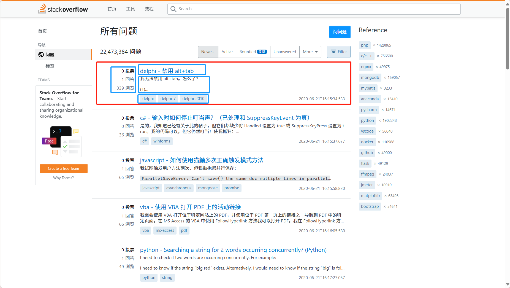
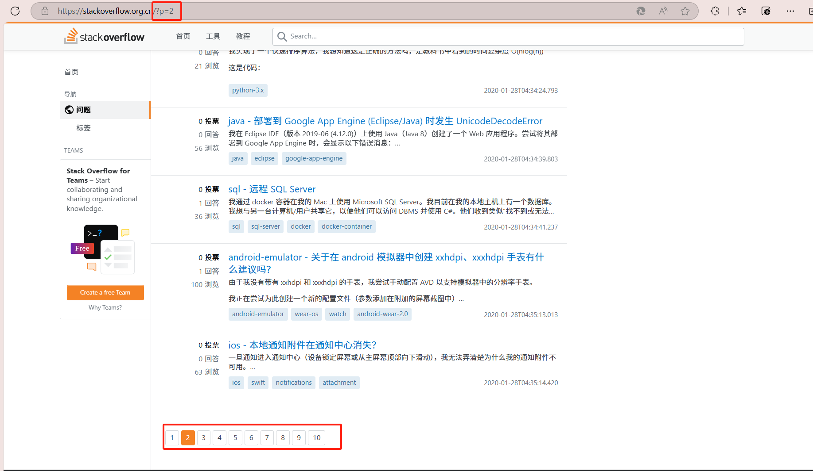
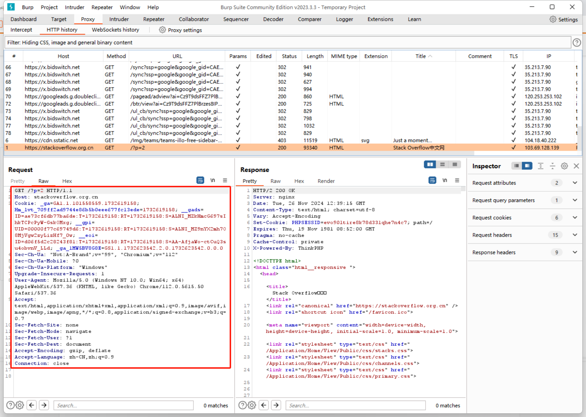
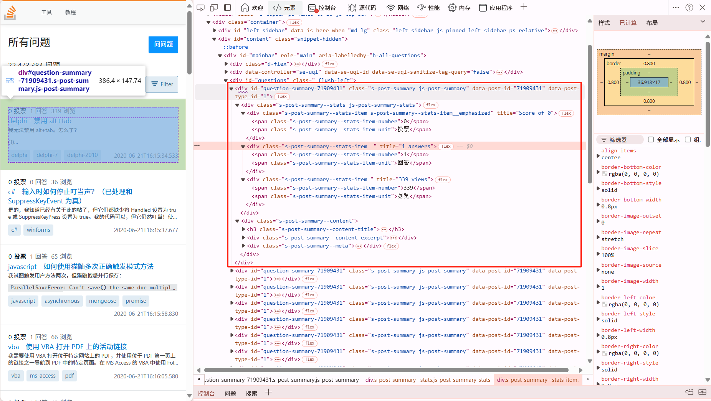

# Writeup

## stackoverflow爬取

### 爬取目标

目标网站为[Stack Overflow中文网](https://stackoverflow.org.cn/)

点击进入，发现不需要登录，便展示了若干回答：



其中蓝框是我们需要爬取的 `scores`，`title`，`description`，`tags`内容。

每页展示的问答数有限，注意到在 url 后加上 `/?p=<page_number>` 即可实现翻页：



### 数据包头构造

利用 `Burp Suite` 访问目标网站，抓包获取数据包头：



据此便可给出 responds 中需要添加的包头：

```python
# 设置请求头，模拟浏览器访问
headers = {
    'Host': 'stackoverflow.org.cn',
    'Sec-Ch-Ua': '"Not:A-Brand";v="99", "Chromium";v="112"',
    'Sec-Ch-Ua-Mobile': '?0',
    'Sec-Ch-Ua-Platform': '"Windows"',
    'Upgrade-Insecure-Requests': '1',
    'User-Agent': 'Mozilla/5.0 (Windows NT 10.0; Win64; x64) AppleWebKit/537.36 (KHTML, like Gecko) Chrome/112.0.5615.50 Safari/537.36',
    'Accept': 'text/html,application/xhtml+xml,application/xml;q=0.9,image/avif,image/webp,image/apng,*/*;q=0.8,application/signed-exchange;v=b3;q=0.7',
    'Sec-Fetch-Site': 'none',
    'Sec-Fetch-Mode': 'navigate',
    'Sec-Fetch-User': '?1',
    'Sec-Fetch-Dest': 'document',
    'Accept-Encoding': 'gzip, deflate',
    'Accept-Language': 'zh-CN,zh;q=0.9',
    'Connection': 'close',
}
```

### 页面处理

构造包头后已经可以通过 responds 爬取到网页内容，下面要从爬取的网页中提取相应数据并储存：

- 利用 `BeautifulSoup` 对 html 进行处理
- 利用 `pandas` 进行数据储存

用 `F12` 进入开发者工具找到相应 html 元素：



根据元素结构进行提取与储存：

```python
import requests
import pandas as pd
from bs4 import BeautifulSoup

# 定义基本 URL
base_url = 'http://stackoverflow.org.cn/?p={}'

# 设置请求头，模拟浏览器访问
headers = {
    'Host': 'stackoverflow.org.cn',
    'Sec-Ch-Ua': '"Not:A-Brand";v="99", "Chromium";v="112"',
    'Sec-Ch-Ua-Mobile': '?0',
    'Sec-Ch-Ua-Platform': '"Windows"',
    'Upgrade-Insecure-Requests': '1',
    'User-Agent': 'Mozilla/5.0 (Windows NT 10.0; Win64; x64) AppleWebKit/537.36 (KHTML, like Gecko) Chrome/112.0.5615.50 Safari/537.36',
    'Accept': 'text/html,application/xhtml+xml,application/xml;q=0.9,image/avif,image/webp,image/apng,*/*;q=0.8,application/signed-exchange;v=b3;q=0.7',
    'Sec-Fetch-Site': 'none',
    'Sec-Fetch-Mode': 'navigate',
    'Sec-Fetch-User': '?1',
    'Sec-Fetch-Dest': 'document',
    'Accept-Encoding': 'gzip, deflate',
    'Accept-Language': 'zh-CN,zh;q=0.9',
    'Connection': 'close',
}

# 初始化一个空列表来存储提取的数据
data = []

# 循环爬取前50页
for page in range(1, 51):
    url = base_url.format(page)  # 构建每一页的URL
    try:
        response = requests.get(url, headers=headers)

        # 检查响应状态码
        if response.status_code == 200:
            print(f"成功获取第 {page} 页网页内容")
            html_content = response.text

            # 使用 BeautifulSoup 解析 HTML
            soup = BeautifulSoup(html_content, 'html.parser')
            questions_div = soup.find('div', id='questions')

            # 遍历每个问题块
            for question in questions_div.find_all('div', class_='s-post-summary js-post-summary'):
                # 提取投票数、回答数和浏览数
                score = question.find('div', class_='s-post-summary--stats-item s-post-summary--stats-item__emphasized').find('span', class_='s-post-summary--stats-item-number').text
                answers = question.find_all('div', class_='s-post-summary--stats-item')[1].find('span', class_='s-post-summary--stats-item-number').text
                views = question.find_all('div', class_='s-post-summary--stats-item')[2].find('span', class_='s-post-summary--stats-item-number').text
                
                # 提取标题和描述
                title = question.find('h3', class_='s-post-summary--content-title').text.strip()
                description = question.find('div', class_='s-post-summary--content-excerpt').text.strip()
                
                # 提取标签
                tags = [tag.text for tag in question.find_all('a', class_='post-tag')]
                
                # 将提取的数据添加到列表中
                data.append({
                    'score': score,
                    'answers': answers,
                    'views': views,
                    'title': title,
                    'description': description,
                    'tags': tags
                })
        else:
            print(f"请求失败，状态码: {response.status_code}，第 {page} 页")
    
    except Exception as e:
        print(f"请求过程中出现错误: {e}，第 {page} 页")

# 创建Pandas数据框
df = pd.DataFrame(data)

# 显示数据框
print(df)

# 保存数据到CSV文件
df.to_csv("stackoverflow_data.csv", index=False, encoding='utf-8')
print("数据已保存为 stackoverflow_data.csv")
```

