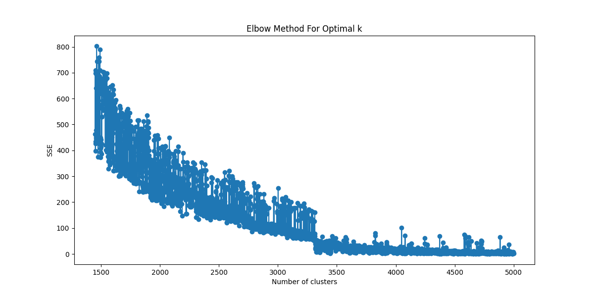

## 预处理使用tag聚类
数据选择：计算不同平台的基尼系数和信息熵，发现 stackoverflow 的数据最好

1. 分词(使用jieba) 停用词处理(使用baidu_stopwords)
2. 出现的tag太少,或者所有的tag出现次数都太少,属于不适合聚类的数据,删除tag,如果一个数据没有tag,删除这条数据
3.  聚类1: 使用louvain进行聚类，然后根据louvain聚类的数量，因为louvain预测新的值需要建立新的图，而kmeans不需要，所以最后还需要是k-means的形式
4. 聚类2:使用k-means进行聚类,过滤使用频率在千分之4之下的tag,使用肘部法,确定最佳的聚类的k值为3400左右,确定最佳k值的时按照tag出现的次数权重提取10000个样本,同时对tag的one-hot编码使用pca进行降维 
5. 
根据肘部图选择合适的 k 值大约为 3400

## 使用body和title进行预测tag
1. 最开始使用预训练的词嵌入技术,存在这样的问题:大量的专业名词没有对应的预训练模型,使用bert中文和英文共存的预训练模型维度过大,训练后有180个g,无法进行处理
2. 最后选择使用tfidf进行预测tag,使用MultiLabelBinarizer对标签进行one-hot编码,使用MultiOutputClassifier进行多标签分类训练(在predict_tag)
特征数量: 230171 预测特征数量 107 相当于 107个LogisticRegression线性回归模型

## 对小红书爬虫数据进行处理，预测 tag 后进行统计：
1. excel 很少，推测是关键词的问题，但是为了获得更好的数据，关键词必须有代码，程序代写，excel 可能是数据处理一类的，这里面的权重不好把握
2. stack overflow 上面明显是前端数据库用的多，machine-learning 很少 xhs 上 machine-learnig 很多，前端数据库较少，推测为 xhs 上各专业都能用得到 machine-learning，学校不教授前端技术
3. c#很多，和直觉不符，源自 stackoverflow 上的 c#很多，导致模型有偏差,c 和 python 的词频比例符合 tag 比例，c#多了

## 小红书 知乎 微信公众号上面的 爬虫
1. 微信公众号上主要是负面新闻，‘非法’，‘风暴’，‘现金’，‘窃取’
2. xhs 和知乎上和技术相关的比较多
## 小红书和知乎上面的 程序员
1. 工作都比较高频
2. 小红书上有生活，日常，健身等出现的明显更多
3. 小红书上是男朋友 知乎上是女朋友
4. 小红书上日本非常高频 查询后发现是日本留学中介喜欢用介绍日本程序员（为什么小红书上都是日本留学这种小众中介，美国英国的比较少）
5.  

### pca降维的原理
其目标是选择 K 个单位正交基，使得原始数据变换到这组基上后，各变量两两间协方差为 0，而变量方差则尽可能大（在正交的约束下，取最大的 K 个方差）。
### MultiLabelBinarize
one——hot 编码
## Support Vector Machine (SVM, 支持向量机)
 SVM 是一种用于分类和回归的监督学习模型。它通过寻找一个超平面来最大化不同类别之间的间隔。
## Random Forest (随机森林)
决策树中的每个节点表示一个特征分裂的条件，而叶子节点存储最终的类别标签（分类任务） 用简单的规则（如“特征 \(x_1 > 5\) 吗？”）将数据划分，没有复杂的权重或激活函数。
## Logistic Regression (逻辑回归)
将输入特征的线性组合（多项式）再通过一个激活函数（sigmoid函数）来预测输出类别的概率。

最后选择Random Forest，
1）能处理非线性关系，因为多个决策树的组合能捕捉到复杂的非线性模式；

2）能直接特征很多的高维数据，因为在训练过程中依旧会从这些特征中随机选取部分特征用来训练；

3）相比SVM，不是很怕特征缺失，因为待选特征也是随机选取；

4）准确率不高的情况下也能尽可能多的捕捉信息

5）简单介绍决策树，随机抽样，构建多个树，民主投票，分裂的时候按照信息熵降低的方向分裂