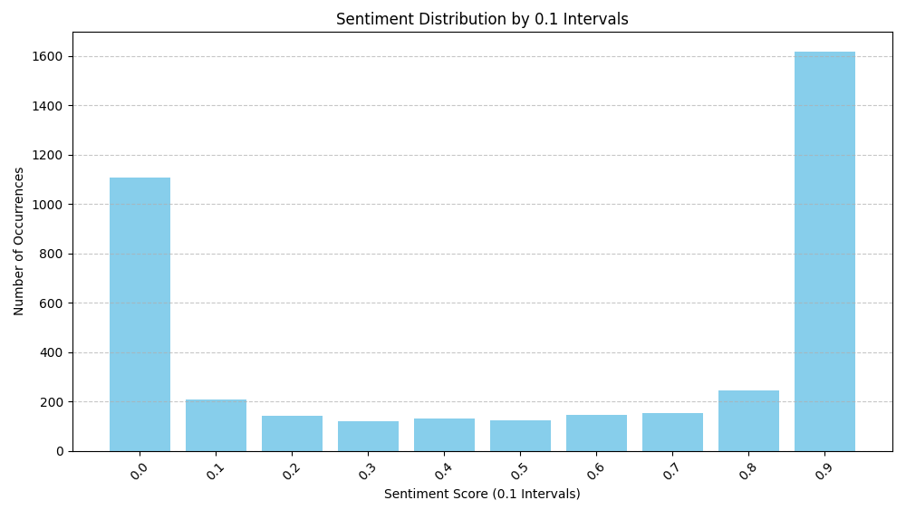
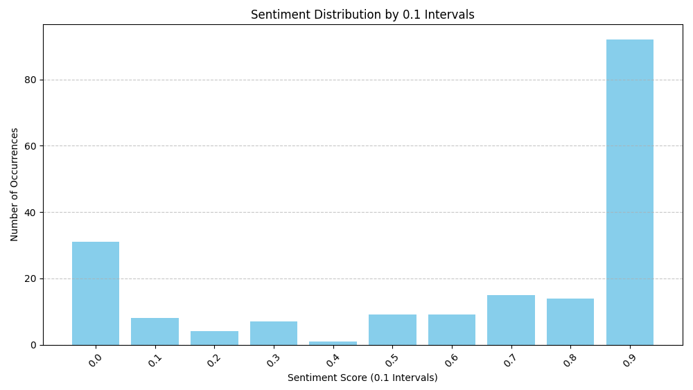
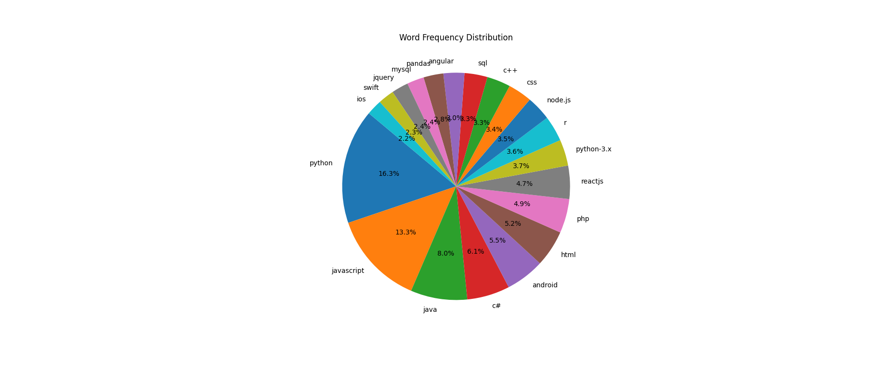
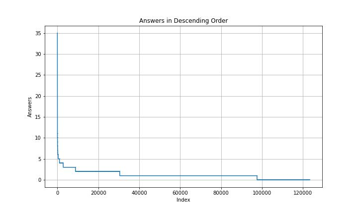
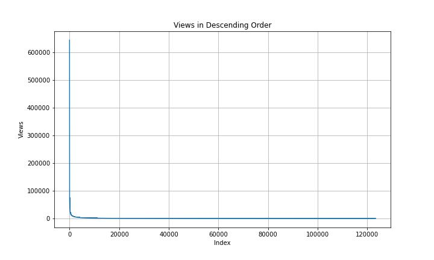
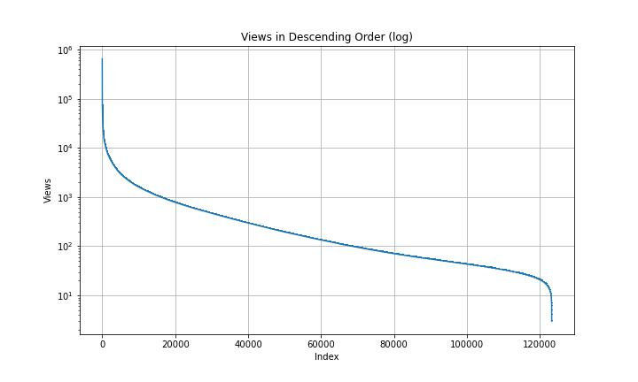
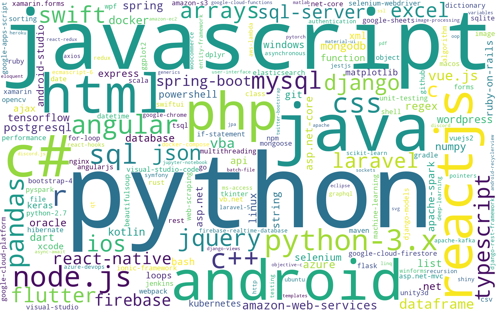
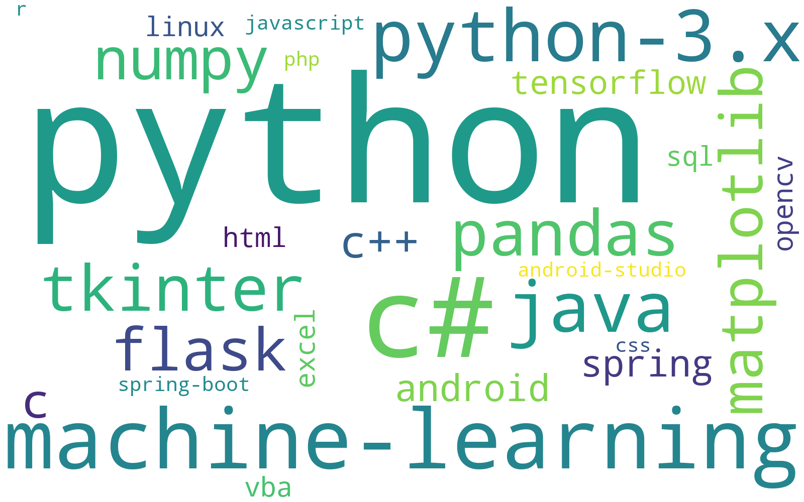

## 情感分析
### stackoverflow
爬虫抓取了stack overflow网站的问题标题和问题内容，对问题内容进行情感分析。
1. 首先对爬取到的数据预处理，由于文本是用户提出的问题，而问题中的英文为专业词汇，与情感无关，所以首先通过正则表达式匹配中文字符，并将匹配后产生的空行去除。得到的中文文本保存到新文件new_chinese_text.csv
2. 采用snownlp对的到的中文文本进行情感分析，用sentiments方法返回一个介于0和1之间的浮点数，表示正面情感的倾向。
   ```py
   df['sentiment'] = df['chinese_text'].apply(lambda x: SnowNLP(x).sentiments)
   ```
3. 设置0.1步长的数组bins定义边界，对sentiment使用pd.cut()方法划分进每个区间。最后使用matplotlib.pyplot绘制情感分布图。预期认为问题中虽然不好判断情感，但总体应该是偏向负面的。结果情感呈现明显的两极分化，要么得分非常低，要么得分很高。所以对如stackoverflow类网站的技术性问题文本不适合情感分析

### zhihu
爬取知乎上有关爬虫技术的帖子，发现积极情感较多。经过查看爬取的帖子内容，发现虽然也有如承担法律风险，反爬斗争等偏负面的内容，但总体上积极评价内容较多



## 对用户关注问题可视化
### stackoverflow
经过停用词，分词等预处理后得到包含关键词和对应出现次数。使用matplotlib.pyplot绘制饼图。

看出stackoverflow用户关注的问题，占据大比例的是编程语言问题，其中python,javascript,java等占比较大。

stackoverflow帖子的回答数分布：

stackoverflow帖子的浏览数分布（第二张图为取对数后的结果）：


回答数和浏览数都近似于指数分布，其中浏览数分布的范围更大。

### 小红书
对小红书上有关代码代写的招募和发布内容进行爬取后，同样进行预处理，之后统计词频，绘制词云。



从词云图中可以看出，小红书上Python代写的较多


小红书上代写的主要场景在于“学习”和“作业”，主要的任务包括优化、修改、编程。

### zhihu
关于代写的帖子的词云：

关于程序员的帖子的词云：

知乎的代写的主要场景在“论文”、“文章”和“工作”。

由孙同庆和陈健坤共同完成
