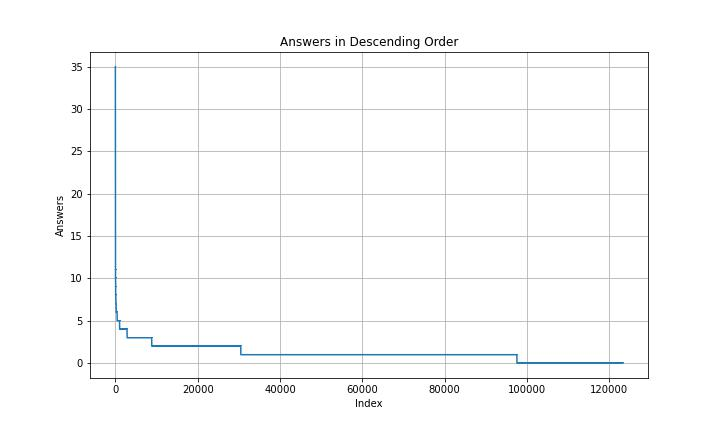
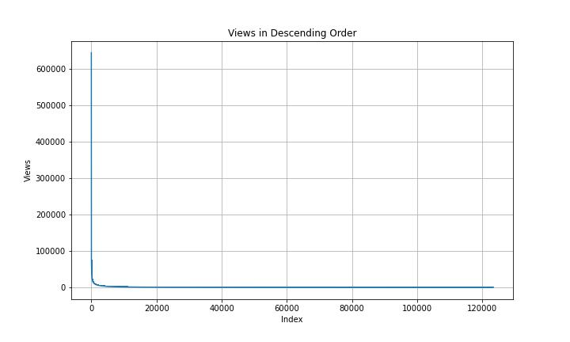
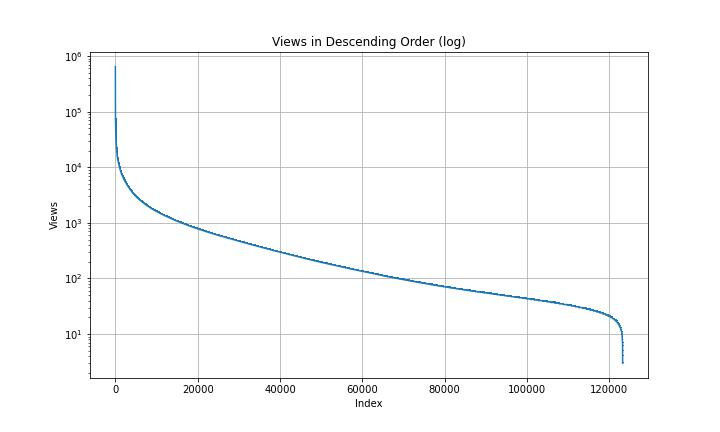
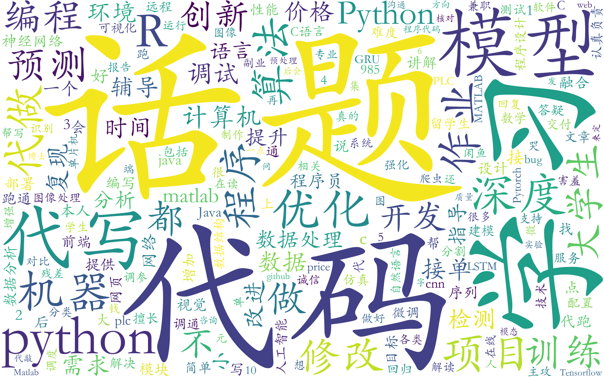

## 对数据进行可视化处理
使用分词对文本进行预处理，过滤掉停用词并绘制词云。

知乎上有关代写和程序员的帖子的词云：

在有关代写的帖子中，python和java的占比最大

stackoverflow帖子的回答数分布：

stackoverflow帖子的浏览数分布（第二张图为取对数后的结果）：

小红书的帖子的词云：

## 情感分析
将帖子里面的中文内容提取出来，使用snownlp对文本进行情感分析，得到的sentiments用于判断情感倾向。
用matplotlib画情感分布图。

由陈健坤和孙同庆共同完成
