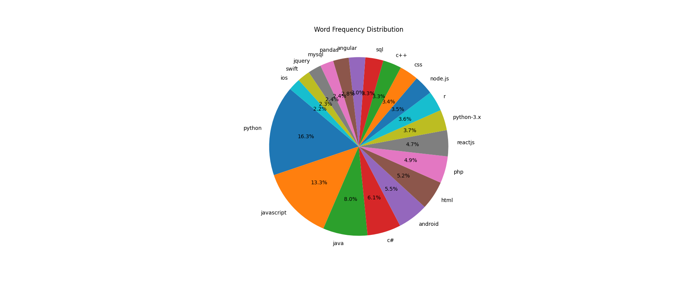

## 对用户关注问题可视化
### stackoverflow
经过停用词，分词等预处理后得到包含关键词和对应出现次数。使用matplotlib.pyplot绘制饼图。

看出stackoverflow用户关注的问题，占据大比例的是编程语言问题，其中python,javascript,java等占比较大。

stackoverflow帖子的回答数分布：
  
stackoverflow帖子的浏览数分布（第二张图为取对数后的结果）：
  
  
回答数和浏览数都近似于指数分布，其中浏览数分布的范围更大。  

### 小红书
对小红书上有关代码代写的招募和发布内容进行爬取后，同样进行预处理，之后统计词频，绘制词云。

  
从词云图中可以看出，小红书上Python代写的较多。

  
小红书上代写的主要场景在于“学习”和“作业”，主要的任务包括优化、修改、编程。

### zhihu
关于代写的帖子的词云：
  
关于程序员的帖子的词云：
  
知乎的代写的主要场景在“论文”、“文章”和“工作”。知乎的程序员主要关注的是“技术”和“工作”。 
 

## 情感分析
将帖子里面的中文内容提取出来，使用snownlp对文本进行情感分析，得到的sentiments用于判断情感倾向。
用matplotlib画情感分布图。 
 
由陈健坤和孙同庆共同完成
